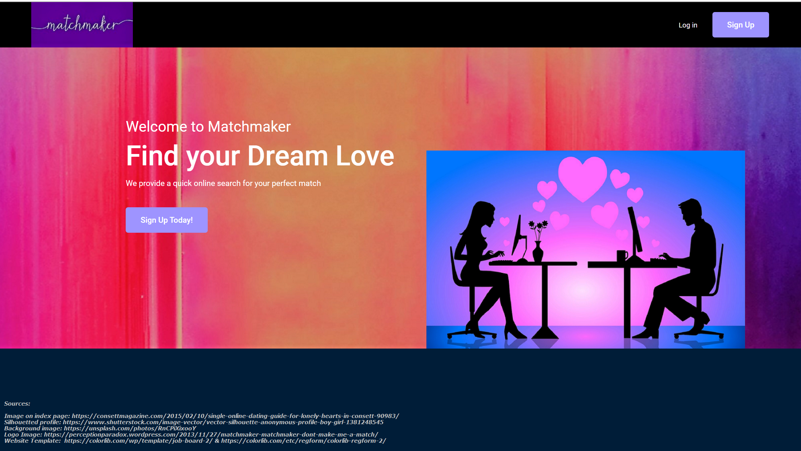

# Dating-Website
UL project

Matchmaker is an online dating agency that users can access via the web in order to get information about and contact other people that they may be interested in meeting offline. By registering, a user can become members of the agency and are then able to create their own profile and upload their details and photos. All the information is maintained on the database constantly monitored.
The site is interactive and built by using HTML, CSS, Bootstrap, JS, PHP, and MySQL.  (Team: Denisio Togashi - Michelle Hourihan - Laszlo Szlatki - Patrick O'Neill).
Check the prototype <a href="https://dtweb.ddns.net">here</a>.

***
  

***
  
 
 ***
  
 
 ***
  
 
 ***
  
 
 ***
  
 
 ***
  

***
  

